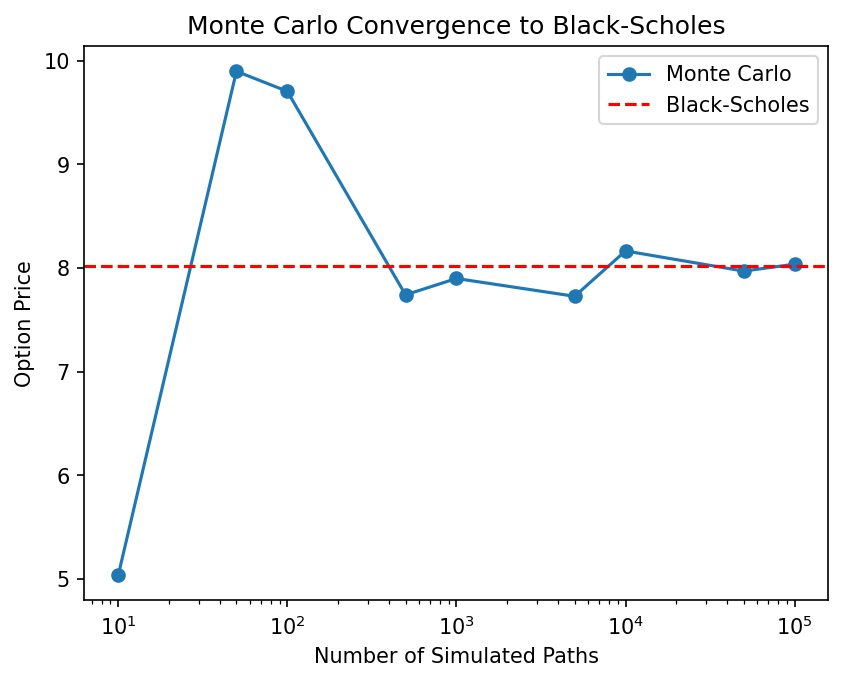
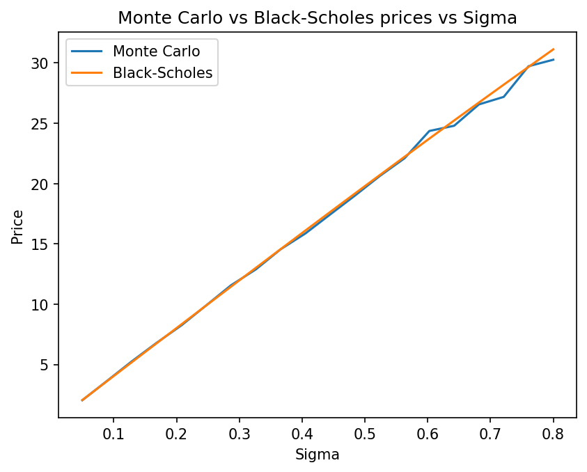
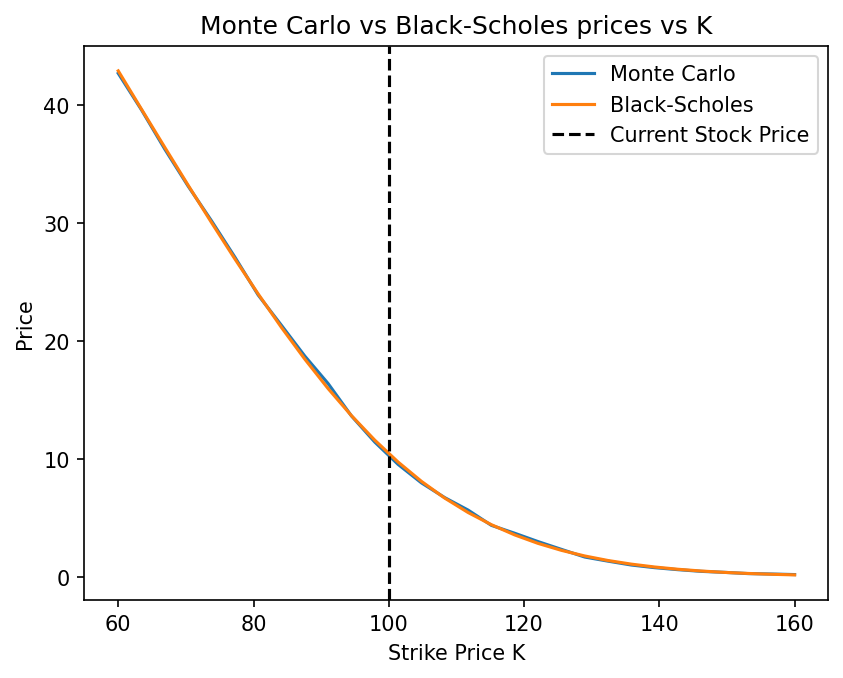
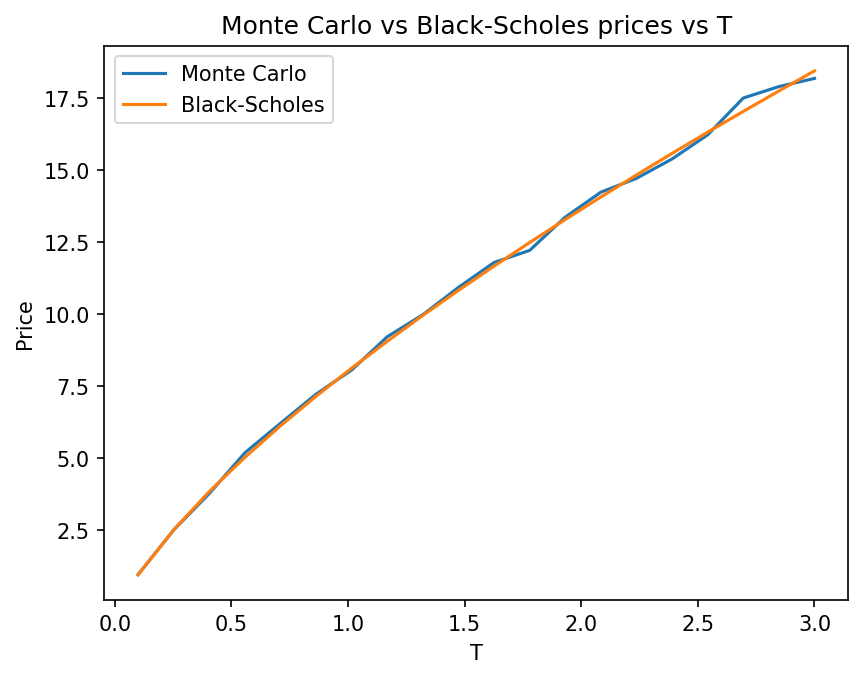
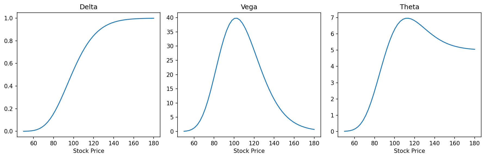

# Black-Scholes Option Pricing

A quantitative finance project pricing European call options using 
Monte Carlo simulation and the Black-Scholes formula, built in Python.

## Background

A European call option gives the holder the right, but not the 
obligation, to buy a stock at a fixed price (the strike price $K$) 
at a future date (the expiry $T$). The payoff at expiry is:

$$\text{Payoff} = \max(S_T - K, 0)$$

If the stock ends above the strike, you profit. If it ends below, 
you simply don't exercise the option and lose only what you paid for 
it. The question is: what is a fair price to pay for this guarantee?

## The Model

Stock prices are modelled using Geometric Brownian Motion:

$$S_t = S_{t-1} \cdot e^{(r - \frac{1}{2}\sigma^2)\Delta t + \sigma\sqrt{\Delta t}\, Z_t}$$

where $Z_t$ is standard Gaussian noise, $r$ is the risk-free rate, 
and $\sigma$ is the volatility of the stock.

Black and Scholes showed that under this model, the exact option 
price is given by:

$$C = S_0 \cdot N(d_1) - K e^{-rT} \cdot N(d_2)$$

$$d_1 = \frac{\ln(S_0/K) + (r + \frac{1}{2}\sigma^2)T}{\sigma\sqrt{T}}, \qquad d_2 = d_1 - \sigma\sqrt{T}$$

where $N(\cdot)$ is the cumulative standard normal distribution.

## What the Notebook Contains

- Vectorised GBM stock price simulation
- Monte Carlo option pricer
- Black-Scholes analytical formula implementation
- Convergence analysis — Monte Carlo vs Black-Scholes
- Sensitivity analysis across volatility, strike price, and time
- The Greeks — Delta, Vega, and Theta

## Key Results

### Monte Carlo Convergence

With only 10-100 simulated paths the Monte Carlo estimate is noisy 
and unreliable. By 100,000 paths it converges tightly to the 
Black-Scholes value, demonstrating the Law of Large Numbers in action.

### Sensitivity Analysis

Option price rises nearly linearly with volatility. Higher volatility 
means more uncertainty about the future stock price — and since option 
payoffs are asymmetric (you benefit from large upward moves but are 
protected from downside), more uncertainty always increases option value.

Option price falls smoothly as the strike price increases. The dashed 
line marks the current stock price — options to the left are already 
profitable (in the money), options to the right require the stock to 
grow before paying out (out of the money).

Option price grows with time to expiry but at a decreasing rate, 
reflecting the square root of time scaling of uncertainty under 
Brownian motion.

### The Greeks

- **Delta** forms an S-curve from 0 to 1, representing how much the 
  option price moves per £1 move in the stock. Also approximates the 
  probability the option expires in the money.
- **Vega** peaks at the money, where volatility has the most impact 
  on the uncertain outcome.
- **Theta** shows time decay is largest at the money, where remaining 
  time matters most.

## Main Ideas Explored

- Geometric Brownian Motion as a model for stock prices
- Monte Carlo simulation for derivative pricing
- The Black-Scholes formula and its assumptions
- Law of Large Numbers — convergence of simulation to theory
- Sensitivity analysis across key parameters
- The Greeks as measures of risk exposure

## Tools

- Python
- NumPy
- Matplotlib
- SciPy

## Author

Yarin Negyal — first year Mathematics student at the University of 
Warwick, interested in quantitative finance and stochastic processes.
